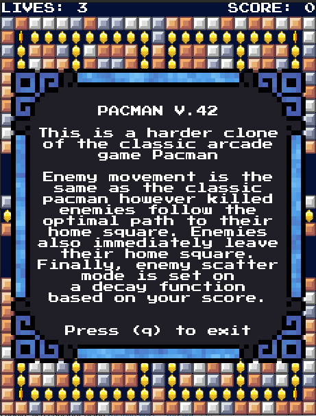
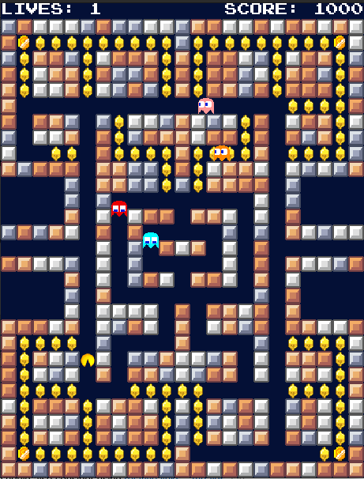
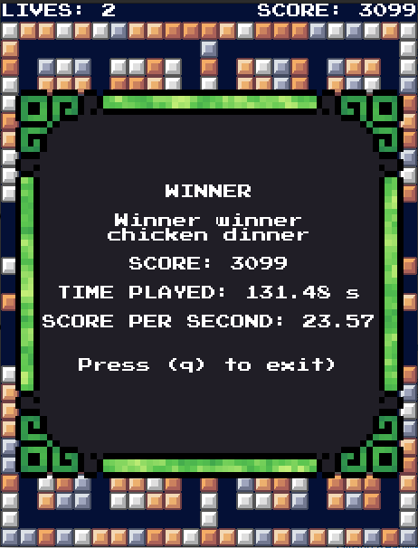

# PACMAN V.42
Pacman V.42 is a clone of the classic arcade pacman with some slight twists to up the difficulty

<p align="middle">
    
    &nbsp;
    
    &nbsp;
    
    &nbsp;
</p>

---
### Gameplay
- Enemy movement and pathing is the same as in classic Pacman
- Killed enemies follow the optimal path to their home squares
- Enemies won't idle in their home squares at the start of the game nor when revived
- Enemy scatter mode is set on a decay function based on your score so the higher your score the less time they spend in scatter mode
- Use the arrow keys to move
- Maximize your score in the least amount of gameplay possible in order to have the highest score per second
---
### Running
> Make sure to have Go installed
```bash
git clone https://github.com/NickGalindo/PacmanV.42.git
cd PacmanV.42
go build -o PacmanV42.sh
chmod +x PacmanV42.sh
./PacmanV42.sh
```
